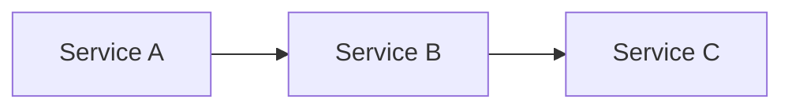
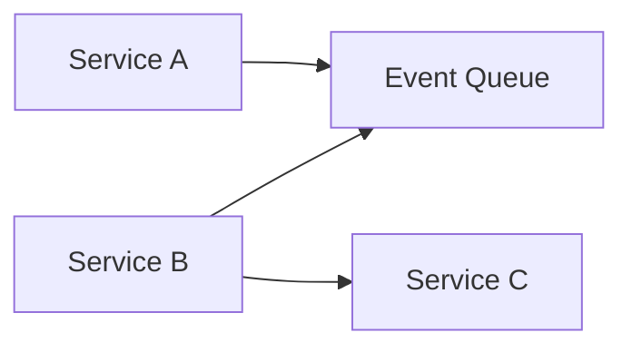

Martin Fowler sums up the reason a software architect would want to use events in a system beautifully in a talk he gave at the GOTO conference from 2017 in Chicago.

Roughly paraphrased:
> "... You use events to reverse the dependencies between services as you would with components ..."

**A bunch of services depending on each other:**

**Dependency between services A & B inverted by sticking an event queue in between them:**

Talk: The Many Meanings of Event-Driven Architecture with Martin Fowler (https://www.youtube.com/watch?v=STKCRSUsyP0)

He explains that with events you get to make this trade off between dependency inversion and invisibility. Since events can trigger actions in many services. Establishing a queue between more then 2 services makes reasoning about the system exponentially harder with the growing number of services.

To circumvent that problem Fowler encourages the concept of "Event Sourcing". A ledger that can rebuild the current application state from the last known application state and all the events in order from the ledger(kind of like a version control system). 
