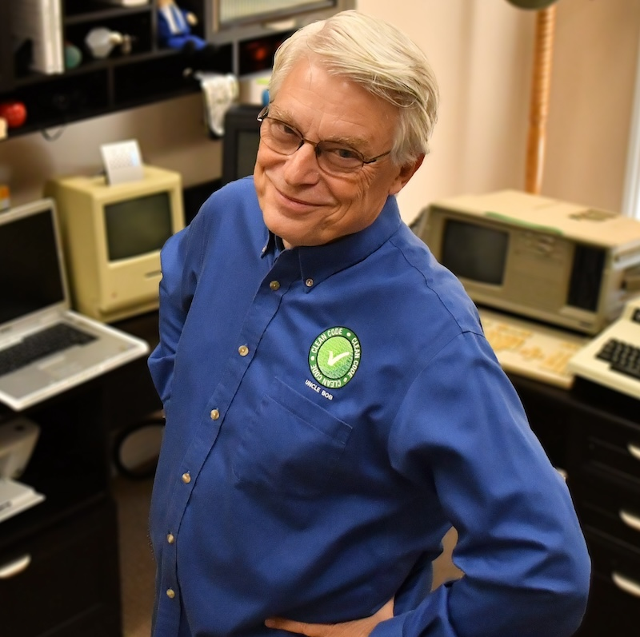
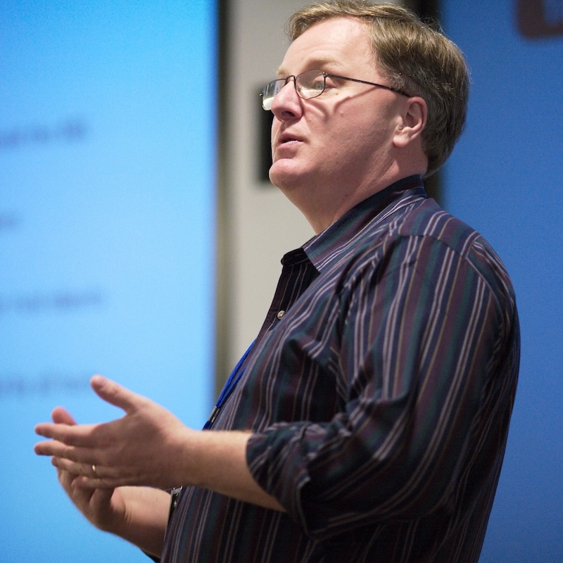
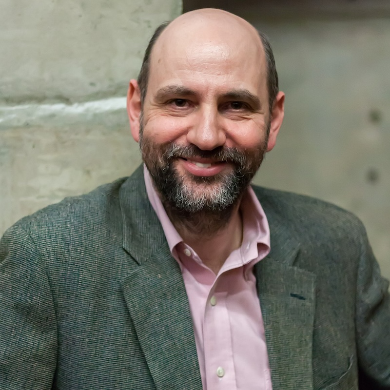

# Characters
## Robert Martin

The Author of Clean Code, Clean Architecture, and Clean Agile is one of the most famous co founders of the agile movement and the worlds wide best know advocate for professionalism of software engineers.
## Dave Thomas

The author of The Pragmatic Programmer is the pragmatic co founder of the agile movement. His views are leading pragmatic movements like the plain text / markdown movement around the world.
## Martin Fowler

Martin Fowler is the leading expert when it comes to good software architecture and technical reasoning. His talks are the pros and cons of every technology out there. His books take deep dives into building solutions for the problems of this world.
