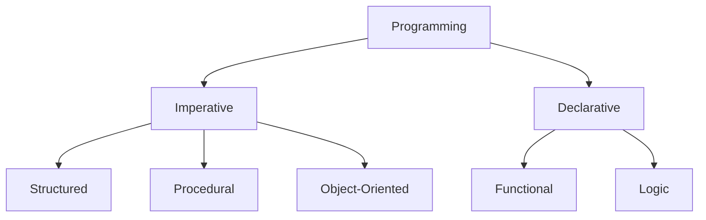
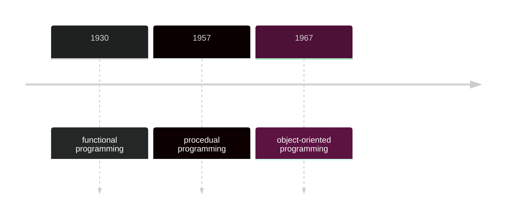

# Programming Paradigms

Imperative Programming: A step by step definition of a procedure or process where each step get you one step closer to the end goal

Declarative Programming: A way of declaring the expected output from given input

---

Procedural Programming is purely imperative.

Object-Oriented Programming can be written in an imperative or declarative manner. We often write imperative code to describe the lower level logic while we use declarative code to work with higher level abstractions.

Functional Programming is almost purely declarative. There still can be imperative code to describe logic in the lower level functions.

---

Every paradigm can be used for something. It depends what input, output and requirements we are dealing with.

---

